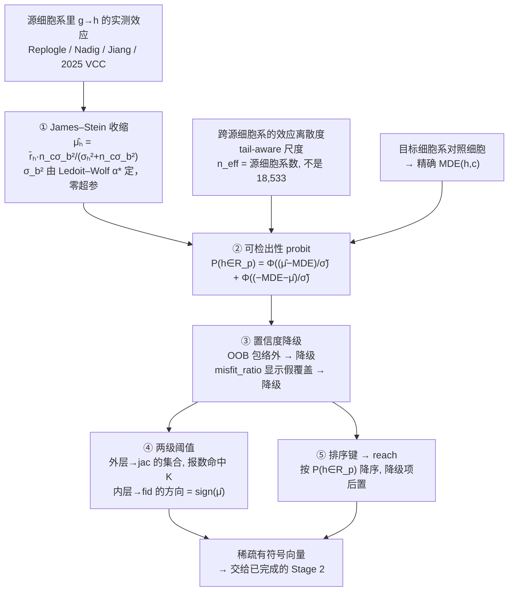

# 05 · Stage 1 设计

**状态：设计已定，待实现。** 这是整条流水线唯一的红灯。

Stage 2 保证：**只要能预测出「哪些基因变了、涨还是跌、涨多少」，分数就是确定的** ——
中间没有任何损耗。

---

## 根本的重构：预测**测量结果**，而不是预测**现象**

所有人都在建模生物学，然后**希望**统计检验会同意。但要预测的东西**不是**一个生物量 ——
它是「一个特定的统计检验，作用在一个特定的有限样本上，得到的输出」。

$$R_p \;=\; \underbrace{\{h:\ \text{生物上真的变了}\}}_{\text{未知，需要建模}}
\;\cap\; \underbrace{\{h:\ \text{在这个细胞系里检得出来}\}}_{\textbf{官方已经交给你了}}$$

**第二个集合完全由发给你的 18,400 个对照细胞决定，不含一丝生物学**，用 BH 有效阈值算出的
跨基因范围是 **6.8×**（p95/p25，[F6](02-findings.md#f6)）。

⚠️ **但理论确认下来它只是边际修正项**：只按可检出性排序的上限是 $h=0.130$，
而追平榜首需要 $h\ge0.134$（[F15](02-findings.md#f15)）。**生物学是必需的，没有捷径。**

### 第二个重构：这是分类 + 排序，不是回归

六个指标里**四个只需要「哪些基因响应」和「涨跌方向」**。幅度只进 `nmae`，而且是归一化的。
全场都在做回归（预测表达量），而评分要的是分类 —— 后者的样本复杂度低得多。

---

## 装配图

---

## 逐步骤

### ① 先验均值：源域 → 收缩

对每个 (敲低基因 $g$, 候选响应基因 $h$)，把 $g$ 在**各个源细胞系**里对 $h$ 的实测效应
收缩到跨源池化均值：

$$\hat\mu_h = \bar r_h \cdot \frac{n_c\sigma_b^2}{\sigma_h^2 + n_c\sigma_b^2}$$

$\sigma_b^2$ 由 Ledoit–Wolf $\alpha^\ast \to \nu_0$ 恒等式定出，**零超参**。
这一点关键：**Stage 1 没有验证集**，任何需要调超参的方法都无处可调。

`src/vcclab/shrinkage.py` · 源形式：AdaptiveEROP `src/HierarchicalBayes/{inverse_wishart,mean_shift}.jl`

**维度轴必须转置**：协方差建在细胞系轴上（$p = 3\sim8$），不是基因轴（$p=18{,}533$）。
8×8 分解免费；$18{,}533^2$ 装不下。语义上也更对 —— 要建模的是「同一效应在不同细胞系之间」的相关性。

### ② 不确定度

跨源细胞系的效应离散度 $\tilde\sigma_h$，两个纪律：

- **tail-aware 尺度**：$\text{tail\_index} = \text{std}/(1.4826\,\text{MAD})$；
  >3 时改用 $(p_{98}-p_{02})/(2\times2.0537489)$。LFC 残差重尾，裸 MAD 不够稳健。
- **$n_{\text{eff}}$ = 独立源细胞系数，不是 18,533 个基因。**
  按基因数算会让置信区间假窄约 $\sqrt{18533/5} \approx 61$ 倍。

### ③ 可检出性 probit

$$P(h \in R_p) = \Phi\!\left(\frac{\hat\mu_h - \text{MDE}_{h,c}}{\tilde\sigma_h}\right)
+ \Phi\!\left(\frac{-\text{MDE}_{h,c} - \hat\mu_h}{\tilde\sigma_h}\right)$$

`src/vcclab/probit.py` · MDE 由 `src/vcclab/detectability.py` 从对照细胞精确算出。

**省算力的门控**：只有 $|\hat\mu_h - \text{MDE}|/\tilde\sigma_h < 1$ 的基因（约 2k 个）
需要走经验 CDF 的非参处理，其余 16k 用解析 $\Phi$，误差 < 2%。

### ④ 置信度降级

| 触发 | 依据 |
|---|---|
| $h$ 在目标系的基础表达落在源系表达**包络之外** | bnode D6 OOB envelope fraction |
| misfit_ratio 显示「区间宽是因为均值预测错了」而非真噪声 | bnode C1 |

降级项在排序键里后置。

### ⑤ 两级阈值（不是一个分数）

ANM 的嵌套观测量 $Q_f \subseteq P_f$ 直接对应评分结构：

| 层 | 判定 | 指标 |
|---|---|---|
| 外层 | $P(h\in R_p) > \theta_{\text{out}}$，且报数命中 $K$ | `jac` |
| 内层 | 在外层集合内，方向 $= \text{sign}(\hat\mu_h)$ | `fid` |

### ⑥ 报数 $K$

$\mathbb{E}\lvert R_p\rvert \approx 288$ 已由 [F8](02-findings.md#f8) 从官方基线锚点白拿。
用 ANM 的 half-support 塌缩把 $K$ 从常数变成随细胞系可计算的量。

### ⑦ 幅度：不要回归它

`nmae` 是归一化的（预测全 0 恰好得 1.0）。所以：

1. 幅度**排序**从源域拿（可迁移）
2. 幅度**尺度**缩放到目标细胞系自己的动态范围
3. 剩下一个全局收缩系数 $\lambda$ —— 这个指标关于 $\lambda$ **凸且分段线性**，
   3 次线上探针夹出最优值

---

## 符号：两个互相独立的弱信号

`fid` 全场 0.514 = 掷硬币。符号有两个来源，性质正交：

| 信号 | 来自 | 优点 | 缺点 |
|---|---|---|---|
| **源域反应** | Replogle 等数据里 $g$ 被敲低在别的细胞系的实测方向 | 生物学为真 | 与目标细胞系无关 |
| **目标系共表达** | 目标细胞系**自己那 18,400 个对照细胞**里 $h$ 与 $g$ 的相关性 | **细胞系特异，免费** | 只是相关不是因果 |

第二个的逻辑：敲低 $g$ → $g$ 下降 → 与 $g$ 正相关（同一程序内）的基因跟着下降，即
$\text{sign}(\delta_h) \approx -\text{sign}\big(\text{corr}(g,h)\big)$，相关性在**目标细胞系内部**算。

这正好补上迁移最难补的那块 —— **「这个细胞系是怎么接线的」**。
两个弱信号相乘，比任何一个单独用都强，而且第二个不需要外部数据。

强度待测：[E06](../experiments/E06-coexpression-sign/)。

---

## 算力预算

| 步骤 | 预估 | 依据 |
|---|---|---|
| 建 ψ 表 + MDE（每细胞系一次） | 12.8 s + < 30 s | 实测 |
| 源域平均谱（一次性） | 61.3 GB → 731 MB | 流式提取 |
| ① 收缩 | $O(p)$，毫秒 | 对角退化 |
| ③ probit | 向量化，秒级 | 9,929 × 900 |
| Stage 2 构造全 panel | 4 分钟 | 实测 0.28 s × 900 |
| 自评全 panel | 6 分钟（十核） | 实测 |
| **一轮完整迭代** | **≈ 10 分钟** | 内存内，不写盘 |

全部 CPU。M1 Pro / 16 GB / 无 CUDA 足够。

---

## 评测 harness

照抄 AdaptiveEROP `benchmark/realdata/verify_skipkill_matched_pr.py` 的结构：
**不看绝对 precision，看 matched operating point** 下的
recall@matched-precision / precision@matched-recall / PR-AUC / block bootstrap CI。

Stage 1 的候选集选择正是这个形状：从 18,533 里选 ~288，base rate 1–2%。

审计用 **leave-one-cell-line-out**（ANM 纪律），并把失败留在分母。

---

## 诚实的边界

这套做法**不解决** `pds`（认得出是哪个扰动）。那一项要真的生物学信号，
大模型确实提供了（榜首原始分 0.820 对基线 0.500），Stage 2 在那上面帮不上忙。

它解决的是另外那三分之二 —— 而那三分之二现在**是空的**，原因不是模型不够大，是：

1. 没人把解码器做对（99.3% 乱报，[F7](02-findings.md#f7)）
2. 没人算过可检出性（6.8× 的动态范围白扔 —— 但这只是边际项，[F6](02-findings.md#f6)）
3. 没人分开处理符号和幅度（一个可迁移，一个不可）
