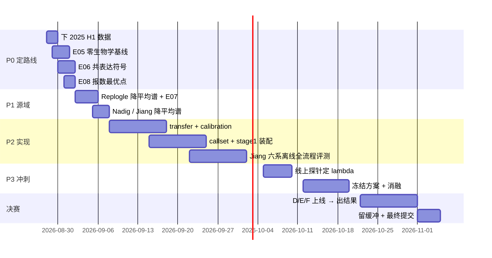

# 07 · 路线图

**赛程剩余**：距决赛集放出（2026-10-22）56 天，距最终截止（2026-11-05）70 天。

**唯一红灯**：Stage 1。其余全绿。

---

## 优先级排序

### P0 · 决定路线的三个实验（不需要外部数据，只需去年 H1 数据）

这三个数一出来，Stage 1 的技术路线就定了。

| 实验 | 问题 | 为什么先做 |
|---|---|---|
| [E05](../experiments/E05-detectability-only-baseline/) | 只用可检出性排序、报 ~288 个基因，`jac` 能到多少？ | **零生物学基线。** 如果落在 0.15 以上，不用等 Stage 1 建模就能上线拿第一 |
| [E06](../experiments/E06-coexpression-sign/) | 目标细胞系内共表达能否预测涨跌方向？$\text{sign}(\delta_h) \approx -\text{sign}(\text{corr}(g,h))$ | 这是**唯一细胞系特异且免费**的符号信号，补上迁移最难补的那块 |
| [E08](../experiments/E08-callset-size/) | 报数 $K$ 的经验最优点是否在 $\mathbb{E}\lvert R_p\rvert \approx 288$ 附近？ | 验证 [F8](02-findings.md#f8) 的反推，纯解析可先算，再用数据确认 |

**前置**：下载 2025 VCC H1 hESC 数据集（同一 10x Flex 化学、同一处理流程，
既有对照也有答案 —— 是唯一能同时验证 MDE 与生物学信号的素材）。

### P1 · 源域数据准备

| 实验 | 内容 |
|---|---|
| [E07](../experiments/E07-source-coverage/) | Replogle K562 全基因组降成 per-perturbation 平均谱（61.3 GB → 731 MB，流式，磁盘占用 ≈ 0），然后回答：**300 个待预测基因里有多少在源数据里有实测反应？** |

**这个数字决定路线：**

- 覆盖率**高** → 问题是「把已知反应搬到新细胞系」→ 低秩迁移 / 经验贝叶斯收缩足够
- 覆盖率**低** → 问题变成「预测没见过的扰动」→ 完全不同的技术路线

其余源域数据（按优先级）：

| 数据集 | 用途 | 原始 | 平均谱 |
|---|---|---|---|
| 2025 VCC H1 | 同化学同流程，MDE 校准 + 三个 P0 实验的唯一素材 | 中 | — |
| Replogle 2022 K562 全基因组 | 300 个 target 的实测方向主来源 | 61.3 GB | 731 MB |
| Replogle 2022 RPE1 | 第二个源细胞系 | 8.1 GB | 152 MB |
| Nadig 2025 HepG2 + Jurkat | 再加两个源细胞系 | 13.9 GB | ~200 MB |
| Jiang 2025 六个癌系 | **离线练习场** —— 结构与本届任务同构，可自建锚点做完整跨系评测 | — | ~300 MB |

### P2 · 实现 Stage 1

按 [05-stage1-design](05-stage1-design.md) 的装配图，分模块落地：

- [x] `src/vcclab/detectability.py` —— MDE
- [x] `src/vcclab/shrinkage.py` —— James–Stein + Ledoit–Wolf→ν₀
- [x] `src/vcclab/probit.py` —— 可检出性概率 + 非参门控
- [ ] `src/vcclab/transfer.py` —— 源域平均谱加载 + 维度轴转置的协方差
- [ ] `src/vcclab/calibration.py` —— OOB envelope + misfit_ratio 降级（bnode 公式）
- [ ] `src/vcclab/callset.py` —— 两级阈值 + half-support 自适应 $K$
- [ ] `src/vcclab/stage1.py` —— 装配

### P3 · 线上探针（谨慎，只花该花的）

| 目的 | 设计 | 花费 |
|---|---|---|
| 定出最优收缩系数 $\lambda$ | `nmae` 关于 $\lambda$ 凸且分段线性 → 3 个 $\lambda$ 值包围 | 3 次 |
| 确认 $\mathbb{E}\lvert R_p\rvert$ | 令 $\hat R$ = 全部门内基因，回读 `jac` 原始分 = $\lvert R_p\rvert / 9{,}929$ | 1 次（可省，已由 F8 推出） |

**纪律**：只提取可迁移的超参数，不要记忆某个集合。决赛轮是不同细胞系 + 不同 panel，
记忆 validation panel = 决赛轮归零。

---

## 时间线

---

## 三个决策点

**① 什么时候上线提交？**
只在两种情况：本地分数创了新高，或要套取未知量。后者是明确的信息交易。

**② 用什么当离线基准？**
官方不公开 A/B/C 的答案，所以本地分数没法直接对齐线上。解法是拿 **Jiang 2025 的六个癌细胞系**
做替身 —— 结构与本届任务同构（多细胞系、CRISPRi），留三个当「A/B/C」，
自建 $b$/$r$ 锚点（`cell-eval2` 的 `baseline.py`、`ceiling.py`、`anchor.py`、`scales.py` 都是公开的），
跑同一套打分逻辑。

**③ 决赛轮怎么切？**
10-22 放出 D/E/F，流水线一行不用改 —— 只需重跑建 ψ 表那一步。
**标签绝对不能沿用 A/B/C**（[T1](06-traps.md#t1)）。

---

## 待回答的开放问题

1. **共享响应主轴占多少方差？** Perturb-seq 里存在少数反复出现的全局响应轴
   （增殖、核糖体生成、ER 应激、胆固醇…）。如果占比高，一个「共同响应核 + 可检出性」的
   固定集就能拿到可观的 `jac`，而这**不需要任何扰动特异的生物学**。待 E05 量化。
2. **符号在细胞系间的迁移率是多少？** 假设是「方向比幅度可迁移得多」，但没量过。E06。
3. **$\alpha^\ast$ 会自适应到哪一侧？** AdaptiveEROP 自己的 ablation 显示 $n_c$ 小时分层层会变差。
   $n_c = 3\sim8$ 正在那个 regime 边上，必须实测。
4. **MDE 在决赛轮细胞系上的分布是否类似？** 10.5× 动态范围是 context A 的实测值。
   D/E/F 是全新细胞系，分布形状可能不同 —— 10-22 放出后第一件事就是重算。
