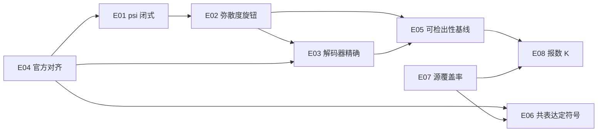

# 实验台账

每个实验一个编号目录, 固定三个文件:

| 文件 | 内容 |
| --- | --- |
| `README.md` | 目的 / 方法 / 实测结果 / 结论 |
| `run.py` | 可重跑的脚本, 固定种子, stdout 可直接归档 |
| `RESULT.md` | 已获得的输出**原文** + 日期 / 机器 / 版本 + 复跑比对 |

跑法 (直接用现成环境, 不要新建 venv):

```bash
cd ~/code/vcc2026-stage1-lab
~/vcc2026/.venv/bin/python experiments/E01-psi-identity/run.py
```

挑战数据默认在 `~/vcc2026`, 用 `VCC_DATA=/path/to/data` 覆盖.
**数据绝不入库** (`*.h5ad` / `*.parquet` 已被 `.gitignore` 拦掉).

台账里的实验一律 pin **可信基线** `~/vcc2026/vcc_local.py` (由
`experiments/_common.py` 加进 `sys.path`), 而不是 pin `src/vcclab/`:
基线是数值行为的 oracle, 移植后的包必须与它逐位一致才算移植成功 ——
于是这些实验同时是 `vcclab` 的回归测试.

## 已完成

| 编号 | 标题 | 状态 | 一句结论 | 耗时 |
| --- | --- | --- | --- | --- |
| [E01](E01-psi-identity/) | Wilcoxon 秩和的闭式约化 | ✅ 3/3 逐位相等 (+真实数据 5/5) | `U_g = sum_i psi_g(v_i)` 与 `scipy.mannwhitneyu` 逐位相等, 含点质量退化情形 -> 打分器对每个基因只经过两个标量 | 10 s (`--real` +60 s) |
| [E02](E02-dispersion-dial/) | 弥散度旋钮 | ✅ 12/12 判定复现 | 锁死均值只改分布形状, p 可从 2.8e-29 调到 0.77; t=3.0 时均值向上而检验说下调 -> 显著性与方向完全解耦 | 15 s |
| [E03](E03-decoder-exactness/) | Stage 2 解码器精确性 | ✅ PASS | 意图 250 个显著 -> 实际 250 个: 召回 100% / 精确率 100% / 假阳性 0 / 方向 100%, 0.28 s/组 -> Stage 2 无损, 全部误差都在 Stage 1 | 20 s |
| [E04](E04-official-parity/) | 与官方 cell-eval2 逐基因对齐 | ✅ 三项全对 | gate 9,929 完全一致, lfc 最大差 1.0e-5, log10(p_adj) 中位差 0.0000, 显著集对称差 0 (必须含并列校正), 快 38.8x | **~10 min** (`--dry-run` 60 s) |

## 待做 (只有 README, 还没有 run.py)

| 编号 | 标题 | 阻塞 | 要回答的问题 |
| --- | --- | --- | --- |
| [E05](E05-detectability-only-baseline/) | 纯可检出性基线 (零生物学) | 需去年 VCC 2025 H1 数据 (才有真实 R 集) | 只按 `mde` 排序、报 ~288 个基因, jaccard 能到多少? 这是任何 Stage 1 模型必须打败的零点 |
| [E06](E06-coexpression-sign/) | 共表达能不能定符号 | 无 (三个 context 的对照细胞就够) | `sign(delta_h) ≈ -sign(corr(g,h))` 的纯度天花板; 在哪个 \|corr\| 阈值上能过 `direction_reach` 的 0.9 门槛 |
| [E07](E07-source-coverage/) | 源数据覆盖率 | 需下载 Replogle 2022 K562 | 300 个靶基因里有多少已有实测反应? 高 -> 迁移已知响应; 低 -> 必须预测未知扰动. **这个数字决定整条路线** |
| [E08](E08-callset-size/) | 报数 K 的经验最优点 | 同 E05 (需真实 R 集) | `argmax_K jac` 是否在 `nReal` 附近, 排序有噪声时往小偏多少 |

依赖关系:



E01–E04 一起把问题切成两半, 并证明后一半已经解完:
**Stage 2 (构造) 无损且比官方快 38.8x, 全部剩余误差都在 Stage 1 (预测)**.
E05–E08 是 Stage 1 的第一批地基: 零点 (E05)、方向 (E06)、数据路线 (E07)、
报数策略 (E08).
